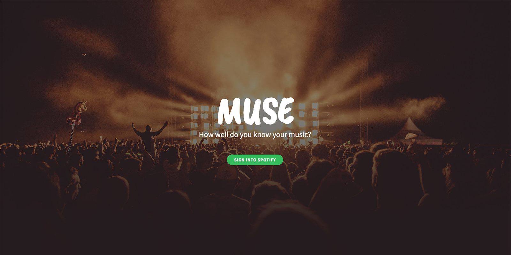
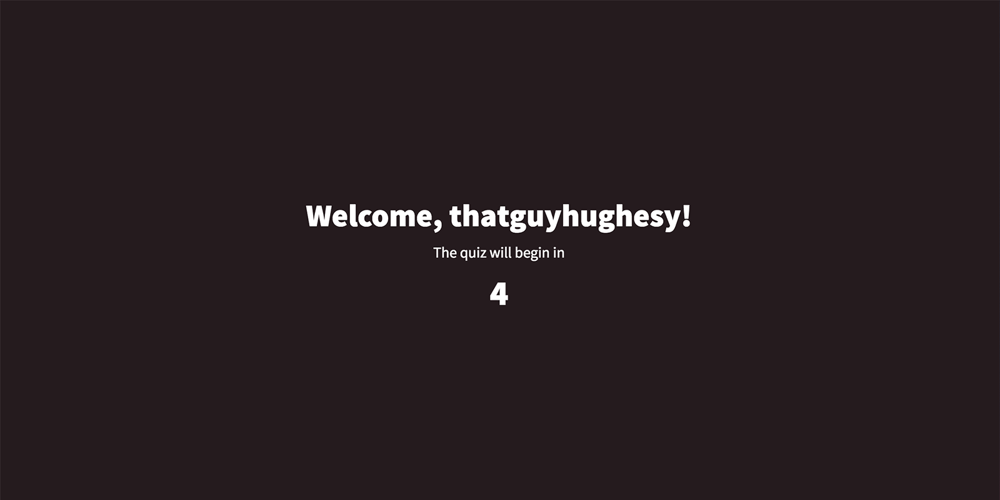
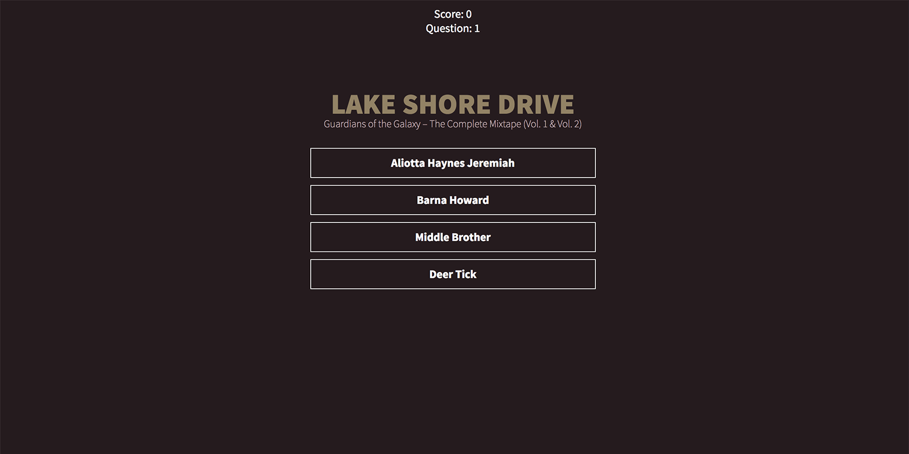
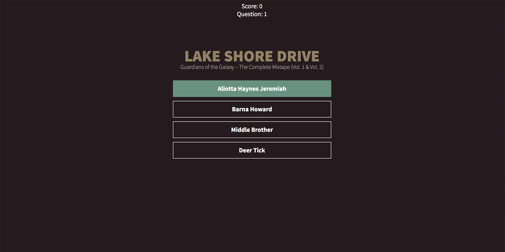

# Muse

A multiple choice music quiz using the Spotify API

## Installation

Requires NodeJS & NPM.

Once installed, clone the repository and install its dependencies running:

    $ npm install

## Run

Go to [My Applications on Spotify Developer](https://developer.spotify.com/my-applications) and create your application. For the examples, register these Redirect URIs:

* http://localhost:3000 (needed for the implicit grant flow)
* http://localhost:3000/callback

Once you have created your app, replace the `client_id`, `redirect_uri` and `client_secret` in `config.js`and run:

    $ node server.js

Then, open `http://localhost:3000` in a browser.

## How It Works

The game is straighforward.  
You're shown the title of a song and the playlist it belongs to.  
You then must choose the correct artist from 4 possible answers.

Some screenshots:

**Landing Page**

**Welcome Page**

**Question**  
The song title and 4 possible artists

**Answer**  
The correct answer is highlighted in green
